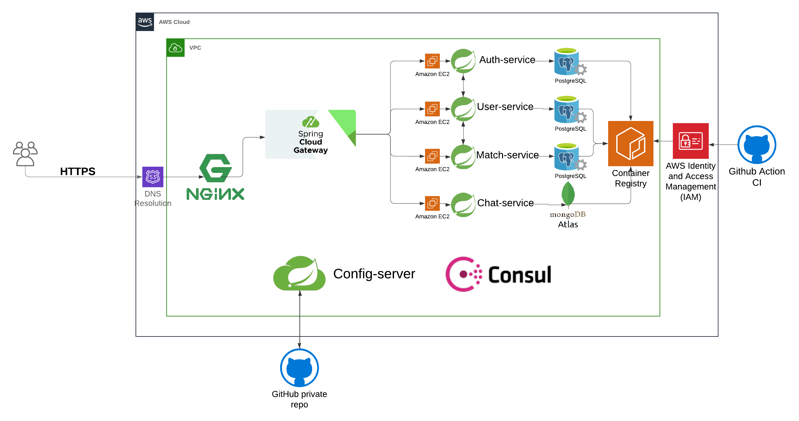

# DevSpark

### Introduction:
* This is the backend services for project DevSpark, our goal is to build a **tinder for engineers**

### Our Distributed System Architect:

### Tech stacks we used:

* Built in **`Java 21`** BellSoft Liberica 
* Uses the [Spring Boot 3.2.4](https://github.com/spring-projects/spring-boot)
* Uses [Spring Cloud Gateway](https://github.com/spring-cloud/spring-cloud-gateway) to route traffic to services
* Uses [Spring Cloud ConfigServer](https://github.com/spring-cloud/spring-cloud-config) to centralize configuration
* Uses [Spring Cloud OpenFeign](https://github.com/spring-cloud/spring-cloud-openfeign) for inter-service communication
* Uses [PostgreSQL](https://github.com/postgres) and [MongoDB](https://github.com/mongodb/mongo)
* Uses [Nginx](https://github.com/nginx) for Inverse proxy
* Uses [Consul](https://github.com/hashicorp/consul) for service registry and discovery
* Uses [Docker](https://github.com/docker) to containerize services